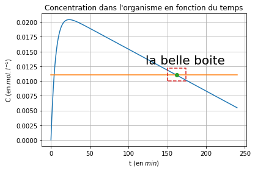
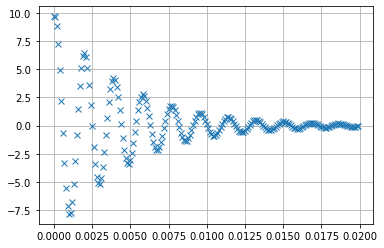
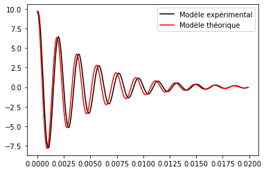
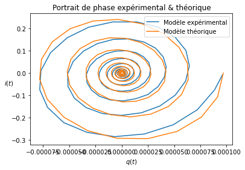

MPSI3 - Informatique commune - 2ème semestre

# TP1 Numpy - lecture de données - tracé de courbes

L'objectif de ce TP est de se familiariser avec un environnement de simulation numérique et quelques éléments des bibliothèques suivantes :
* **`numpy`** : pour générer des tableaux de données homogènes et faire du calcul numérique ;
* **`matplotlib.pyplot`** : pour réaliser des représentations graphiques (`pyplot` est un sous-module de la bibliothèque `matplotlib`).

Pour importer une bibliothèque : 
* **`import numpy`** importe toute la bibliothèque. On accède aux fonctions avec le préfixe `numpy.` : `numpy.cos(numpy.pi)`
* **`:::python from numpy import *`** importe les objets de `numpy` dans l'espace des noms courant écrasant les objets et fonction de même nom. Le préfixe `numpy.` n'est plus nécessaire. Pratique, mais à éviter !
* **`import numpy as np`** importe la bibliothèque avec `np` comme alias. Le préfixe devient `np.`. C'est l'usage courant.


```python
%pylab inline 

from math import *
```

    Populating the interactive namespace from numpy and matplotlib
    

**`%pylab inline`** importe les modules numpy et matplotlib en exécutant en particulier les deux instructions :
* `import numpy as np`
* `import matplotlib.pyplot as plt`

L'option `inline` indique que les figures Matplotlib seront insérées dans le notebook lui-même.

## A. Module Numpy et tableaux Array

Les tableaux Numpy sont de type ndarray, plus connu sous son nom d'alias : *`array`*.

Leurs principales caractéristiques sont :
* tableau multidimentionnel **homogène** : tous les éléments sont du même type, généralement un nombre,
* possibilités de **calculs élément par élément**,
* slicing en lecture et écriture performant,
* possibilité de transformation de la forme du tableau (shape).

Dans ce TP, seuls les trois premiers aspects seront utilisés.

L'accès aux éléments est réalisé comme sur les listes.

Il existe aussi de nombreuses fonctions d'algèbre (calcul matriciel, diagonalisation), d'optimisation,… basées sur ce type.
### A.1 Instructions de création
Il existe plusieurs méthodes pour créer des tableaux. Nous retiendrons ici :
1. **par conversion** à partir d'une liste ou d'une séquence (objet `range`) ;
* par des **fonctions générant une séquence entre deux valeurs** : `np.linspace`, `np.arange`.

#### 1. Création par conversion
La création du tableau est réalisée par conversion de type à partir d'une liste, d'un tuple, d'un autre tableau ou d’une séquence. Le type des éléments est défini automatiquement s'il n'est pas précisé. Remarquer que tous les éléments sont du même type.

L'attribut `dtype` contient le type des éléments.

**A faire :** Exécuter et comprendre les codes de la cellule ci-dessous !


```python
a = np.array([0,1,2,3]) # conversion d'une liste d'entiers
print("Tableau d'entiers :", a)

a = np.array([0.,1,2,3]) # conversion d'une liste comprenant un flottant
print("Tableau de flottants :", a)

a = np.array((0.,'1',2,3)) # conversion d'un tuple comprenant un caractère
print("Tableau de chaînes de caractères :", a)

a = np.array(range(10)) # conversion d'une séquence range
print("Tableau d'entiers :", a)
```

    Tableau d'entiers : [0 1 2 3]
    Tableau de flottants : [0. 1. 2. 3.]
    Tableau de chaînes de caractères : ['0.0' '1' '2' '3']
    Tableau d'entiers : [0 1 2 3 4 5 6 7 8 9]
    

Contrairement au mode standard de Python, toutes les variables sont stockées en mémoire en suivant les conventions du langage C. On retrouve ainsi les codages des entiers non signés (`uint16`, `uint32`, `uint64`), les entiers signés (`int8`, `int16`, `int32`, `int64`), les flottants (`float16`, `float32`, `float64`), mais aussi les complexes (`complex64`, `complex128`).

#### 2. Création comme séquence
Les fonctions suivantes permettent de créer des séquences linéaires en spécifiant un pas ou un nombre d'éléments.
* **`np.linspace(a, b, n)`** renvoie un tableau de $n$ valeurs commençant par $a$ et finissant par $b$. C'est la fonction à utiliser par défaut. En général, on prend $n$ impair pour avoir un nombre d'intervalles pair ;
* `np.arange(a, b, p)`renvoie un tableau allant de $a$ inclu à $b$ exclu avec un écart entre les valeurs valant le pas $p$. Logique similaire à la fonction `range`, mais avec les problèmes de comparaison des flottants. On n'est jamais certain que $b$ soit inclu ou non dans le résultat.

**Question** : quelles sont les différences entre arange et range ?

"range" est limité au type int contrairement à "arange"


```python
print("arange :",np.arange(0, 1.1,0.1)) 	# arange (ini, fin, pas)
print("linspace :",np.linspace(0,1,11)) 	# linspace(ini, fin, nbval)
```

    arange : [0.  0.1 0.2 0.3 0.4 0.5 0.6 0.7 0.8 0.9 1. ]
    linspace : [0.  0.1 0.2 0.3 0.4 0.5 0.6 0.7 0.8 0.9 1. ]
    

**A faire :**
1. créer le tableau `[0, 10, 20, 30, 40, 50, 60, 70, 80, 90]` par conversion d'une séquence range, puis avec np.arange et np.linspace ;
* les afficher et comparer la nature des éléments. Si besoin, on peut compléter la fonction avec le type que l'on souhaite pour les données en précisant l'argument `dtype` (`int` ou `float`...). Exemple : `np.linspace(1, 5, 5, dtype = float)`.


```python
print("Conversion range: ",np.array(range(0,100,10)))
print("np.linspace: ",np.linspace(0,90,10, dtype=int))
print("np.arange: ",np.arange(0,100,10))
```

    Conversion range:  [ 0 10 20 30 40 50 60 70 80 90]
    np.linspace:  [ 0 10 20 30 40 50 60 70 80 90]
    np.arange:  [ 0 10 20 30 40 50 60 70 80 90]
    

### A.2. Différences et similitudes entre listes et tableaux

**A faire :** 
sur `L` et `T` définis dans la cellule suivante, réaliser les opérations ci-dessous, afficher le résultat (fonction `print`) et conclure sur les propriétés des 2 types (listes et tableaux numpy)
* multiplication par un entier (3, par exemple) ;
* addition d'un entier ou flottant (10. par exemple) ;
* multiplication par un flottant (3.1, par exemple) ;
* utilisation de la fonction `sin` sur `L` ou `T` : `sin(L)` ou `sin(T)` ;
* utilisation de la fonction `np.sin` : `np.sin(L)` ou `np.sin(T)`.


```python
L = [0.1, 0.2, 0.3]
T = np.array([0.1, 0.2, 0.3])
print("multiplication par un entier: ", "python: ", 3*L,"numpy: ", 3*T)
print("addition d'un entier ou flottant: ", "python: ", "10.+L","numpy: ", 10.+T)
print("multiplication par un flottant: ", "python: ", "3.1*L","numpy: ", 3.1*T)
#print("sin(): ", "python: ", sin(L),"numpy: ", sin(T))
print("np.sin(): ", "python: ", np.sin(L),"numpy: ", np.sin(T))

```

    multiplication par un entier:  python:  [0.1, 0.2, 0.3, 0.1, 0.2, 0.3, 0.1, 0.2, 0.3] numpy:  [0.3 0.6 0.9]
    addition d'un entier ou flottant:  python:  10.+L numpy:  [10.1 10.2 10.3]
    multiplication par un flottant:  python:  3.1*L numpy:  [0.31 0.62 0.93]
    np.sin():  python:  [0.09983342 0.19866933 0.29552021] numpy:  [0.09983342 0.19866933 0.29552021]
    

L'**accès aux éléments d'un tableau** (le slicing ou tronçonnage) est identique à celui utilisé pour une liste ou une chaîne de caractères.

Si `T` est un tableau :
* `T[2]` retourne le 3ème élément
* `T[-1]` retourne le dernier élément
* `T[3:10:2]` retourne les éléments d'indices compris entre 3 inclu, 10 exclu, avec un pas de 2
* `T[::-1]` retourne le tableau avec les éléments dans l'ordre inverse
* `T[:-1]` retourne tous les éléments sauf le dernier
* `T[:2]` retourne les deux premiers éléments
* `T[2:]` retourne tous les éléments sauf les deux premiers

Si vous voulez essayer :


```python
T = np.array([10, 20, 30, 40, 50, 60, 70, 80, 90])
print (T)
print(T[:2])
print(T[2:])


```

    [10 20 30 40 50 60 70 80 90]
    [10 20]
    [30 40 50 60 70 80 90]
    

Les tableaux numpy peuvent aussi être sélectionnés par une **liste d'indices**.

**A faire :** exécuter et comprendre le code ci-dessous.


```python
T = np.array([10, 20, 30, 40, 50, 60, 70, 80, 90])
print (T)
indices = [0, 3, 8]
print(T[indices])
```

    [10 20 30 40 50 60 70 80 90]
    [10 40 90]
    

### A.3. Calculs élément par élément et rapidité d'exécution
Le code ci-dessous permet d'évaluer le temps mis pour évaluer la fonction $\lambda_1 = \sqrt{(L \cos(\alpha-130°)+a)^2+(L \sin(\alpha-130°)-b)^2}$  pour $n$ valeur de $\alpha$ comprises entre -50° et +50° (mais exprimé en radians). Si $n$ est inférieur à 10000, la courbe est affichée.

Remarquer que la structure comporte, de façon usuelle, les parties suivantes :
* importation des modules,
* définition des fonctions,
* initialisation des variables,
* traitement des données,
* restitution des résultats.

Chaque fonction $\lambda_1$ (`lambda1a` et `lambda1b`) sera appelée 3 fois afin de tenir compte des variations de temps de calcul.

Le temps de calcul ne comprend pas le temps mis pour créer la liste des $n$ valeurs de $\alpha$. Ce temps est faible en comparaison de celui mis pour calculer les $n$ valeurs de $\lambda_1$.

*La définition des listes par comprehension donne une durée de calcul très proche de celle obtenue en utilisant une boucle `for` et `append`.*

La fonction `time()` permet d'obtenir le temps système en secondes.


```python
# -*- coding: utf-8 -*-
# IMPORT des MODULES
from time import time   # fonction retournant la date en secondes
from math import *
import numpy as np
import matplotlib.pyplot as plt

a = 0.14
b = 0.046
L = 0.49

# DEFINITION des FONCTIONS
def lambda1a(alpha0,alpha1,n):
    """calcul de alpha et lambda1 (alpha) par des boucles for et append"""
    
    # création du tableau de alpha avec une boucle for
    dalpha = (alpha1 - alpha0) / (n-1)
    alpha = []
    for i in range(n):
        alpha.append(alpha0 + dalpha * i)
        
    # création du tableau de lambda avec une boucle for
    deb=time()  # temps début calcul
    y = []
    for x in alpha:
        y.append(sqrt((L*cos(x-130./180.*pi)+a)**2+(L*sin(x-130./180.*pi)-b)**2))
    fin=time()  # temps fin de calcul
    print ((fin-deb)*1000, "Millisecondes avec la boucle for")
    return y
```


```python
# INITIALISATION
n=800000 # nombre de valeurs distinctes de alpha
alpha0 = -50/180*pi
alpha1 = 50/180*pi

print ("Temps de traitement avec une boucle for :")
# TRAITEMENT DES DONNEES
res=lambda1a(alpha0, alpha1, n)
res=lambda1a(alpha0, alpha1, n)
res=lambda1a(alpha0, alpha1, n)


# RESTITUTION DES RESULTATS
if n<=10000:
    plt.plot(np.linspace(alpha0, alpha1, n), res)
    plt.grid()
```

    Temps de traitement avec une boucle for :
    1580.4085731506348 Millisecondes avec la boucle for
    1440.6135082244873 Millisecondes avec la boucle for
    1452.070951461792 Millisecondes avec la boucle for
    

**A faire** :
1. modifier $n$ dans le bloc de code précédent pour obtenir un temps de calcul ayant pour ordre de grandeur 1s,
* compléter la fonction `lambda1b` ci-dessous en utilisant `np.linspace` pour créer le tableau des $\alpha$ entre `alpha0` et `alpha1` et un calcul élément par élément pour déterminer le tableau `y` des valeurs de $\lambda_1$,
* estimer le gain en temps d'un calcul élément par élément.


```python
def lambda1b(alpha0,alpha1,n):
    """définition de lambda1 (alpha) par calcul élément par élément"""
    deb=time()

    # A COMPLETER.
    alpha = np.linspace(alpha0, alpha1, n)
    y = np.sqrt((L*np.cos(alpha-130./180.*pi)+a)**2+(L*np.sin(alpha-130./180.*pi)-b)**2)
    
    fin=time()
    print ((fin-deb)*1000, "Millisecondes avec un calcul élément par élément")
    return y

# TRAITEMENT DES DONNEES
res=lambda1b(alpha0, alpha1, n)
res=lambda1b(alpha0, alpha1, n)
res=lambda1b(alpha0, alpha1, n)
```

    90.05165100097656 Millisecondes avec un calcul élément par élément
    79.28776741027832 Millisecondes avec un calcul élément par élément
    88.63496780395508 Millisecondes avec un calcul élément par élément
    

## B. Tracé d'un graphique
### Dégradation d'un liquide dans l'organisme
La cinétique de dégradation d'une boisson dans l’organisme donne une évolution temporelle de sa concentration dans le sang régie par l'équation :

$C_2(t)=\frac{V_1}{V_2}C_{01} (1-e^{-k_1 t})-k_2 t$ en mol/L, avec $t$ en min, et :

- $C_{01}=0,90$ mol/L, concentration initiale dans l'estomac,
- $V_1=1,0$ L, le volume absorbé,
- $V_2=40$ L, le volume total de liquide et de sang dans le corps humain,
- $k_1=0,17$ /min, la constante de vitesse caractéristique de la 1ère phase,
- $k_2=71 \times 10^{-6}$ mol/L/min, la constante de vitesse caractéristique de la 2ème phase.

Le taux légal limite est $C_{2max}$ avec $C_{2max}=0,50$ g/L $=0,011$ mol/L ;
 
** A faire :** en vous aidant de la description des fonctions du module matplotlib.pyplot du mémento :
1. tracer la fonction pour $t$ variant de 0 à 240 min,
* tracer une droite horizontale correspondant à la valeur limite (2 points suffisent),
* afficher la grille, les labels des axes, un titre, 
* afficher un point sur l'intersection entre la courbe et la droite limite, 
* afficher un cadre autour de ce point et un texte au dessus du cadre,
* enregistrer votre figure dans un fichier png en 300 dpi.

Le résultat doit être proche de l'image présente dans le dossier du TP.


```python
C1 = 0.9
V1, V2 = 1., 40.
k1, k2 = 0.17, 71e-6
C2max = 0.011

def C2(t):
    y=(V1/V2)*C1*(1-np.exp(-k1*t))-k2*t
    return y

x=np.linspace(0, 240, 10000)

y=C2(x)
ymax=max(y)


plt.plot(x, y)
plt.plot([0,240],[C2max,C2max])
plt.plot(162,0.0110,marker="o")
plt.plot([150,150,174,174,150],[0.0100,0.0122,0.0122,0.0100,0.0100], linestyle="--")
plt.text(122,0.0129,"la belle boite",size=20)

plt.title("Concentration dans l'organisme en fonction du temps")
plt.xlabel('t (en $min$)')
plt.ylabel('C (en $mol.l^{-1}$)')
plt.grid()
plt.savefig("la belle boite.png")
plt.show()


```


    

    


## C. Lecture et affichage des données d'un fichier
### Tension aux bornes d'un circuit RLC

L'objectif initial de cette partie est de récupérer puis d'afficher des données expérimentales correspondant à l'évolution de la tension aux bornes d'un condensateur qui se décharge dans un circuit RLC série (mesures effectuées au cours du TP n°15 de physique).

Il s'agit ensuite de traiter ces données pour déterminer un modèle théorique à partir du facteur de qualité et de la pulsation propre. Les courbes expérimentale et théorique seront superposées.

Enfin, vous tracerez le portrait de phase expérimental superposé au modèle théorique.

**A faire :**
Au besoin en vous aidant du mémento, compléter la cellule ci-dessous pour afficher les 5 premières lignes du fichier de données expérimentales `acquisition.txt` que vous trouverez dans le dossier du TP. 
Chaque ligne lue comprend un caractère de retour à la ligne qu'il ne faut pas afficher.

Par un copier-coller de votre code, lire et afficher les 5 lignes suivantes.

Remarque : avant ré-ouverture (fonction `open`) il est préférable que le fichier soit "fermé" avec la méthode `fic.close()`.


```python
nom_fic = "acquisition.txt"
fic = open(nom_fic, "r") # on ouvre le fichier en lecture

print("5 premières lignes :")
for i in range(5):
    print(fic.readline().strip())

print("5 suivantes :")
for i in range(5):
    print(fic.readline().strip())

fic.close()
```

    5 premières lignes :
    Temps;EA1{3}
    0;9.69103327440098
    0.0001;9.61124705569819
    0.0002;8.85826461669058
    0.0003;7.21766049461439
    5 suivantes :
    0.0004;4.89887351356447
    0.0005;2.17118216166273
    0.0006;-0.676188518293202
    0.0007;-3.32908029016107
    0.0008;-5.54314785916358
    

### Lecture des données expérimentales
**A faire :** 
Compléter les 2 cellules suivantes afin de créer :
* une fonction `traite` retournant 2 flottants extraits d'une chaîne de caractères. Les deux valeurs sont séparées par un caractère contenu dans l'argument sep ;
* une fonction `lecture` retournant sous forme de deux tableaux numpy les données stockées en colonnes dans un fichier texte.

Puis, **tracer l'évolution de la tension aux bornes du condensateur en fonction du temps**.


```python
def traite(line, sep):
    x,y=[float(x) for x in line.split(sep)]
    return x,y

# essai
x, y = traite("0.0007;-3.32908029016107", ';')
print(x,y)
```

    0.0007 -3.32908029016107
    


```python
def lecture(nomfic, sep):
    nom_fic = "acquisition.txt"
    fic = open(nom_fic, "r")
    line=fic.readline()
    T=[]
    U=[]
    line=fic.readline().strip()
    while line:
        x,y=traite(line, sep)
        T.append(x)
        U.append(y)
        line=fic.readline().strip()
    T=np.array(T)
    U=np.array(U)
    fic.close()
    return(T, U)

    
T, U = lecture("acquisition.txt", ';')
plt.plot(T,U, 'x')
plt.grid()
```


    

    


### Recherche des extréma
**A Faire :**

1. Définir une fonction `indices_max` qui prend en entrée une liste ou un tableau `Y` et qui retourne les indices des valeurs correspondant à un maximum.

* Tracer l'évolution de la tension aux bornes du condensateur en fonction du temps et **compléter ce tracé avec des points situés aux extrémums** déterminés par la fonction `indices_max`.


```python
def indices_max(Y):
    imax=[0]
    for i in range(1,len(Y)-1):
        if Y[i-1]<=Y[i] and Y[i]>=Y[i+1]:
            imax.append(i)
    imax=np.array(imax)
    return(imax)


X,Y=lecture("acquisition.txt", ';')

T=X[indices_max(Y)]
U=Y[indices_max(Y)]

plt.plot(X,Y, '-', color='k')
plt.scatter(T,U, marker='o', color='b')
plt.grid()
```


    

    


### Identification du modèle théorique
**A faire :**

En exploitant les résultats précédents déterminer :
* la **pseudo-période** $T$ avec la meilleure précision possible ;
* le **décrément logarithmique** $\delta$ sachant que :
$$\delta  = \frac{1}{n}\ln \left( {\frac{{u(t)}}{{u(t + nT)}}} \right),~~n \in \mathbb{N}^*$$
* le **facteur de qualité** $Q$ et la **pulsation propre** $\omega_0$ sachant que :
$$\delta  = \frac{2\pi }{{\sqrt {{4Q^2} - 1} }}~~ et ~~T = \frac{{2\pi }}{{{\omega _0}\sqrt {1 - \frac{1}{{4{Q^2}}}} }}$$


```python
#Par la suite l'argument 'x' désigne la liste des abscisses des extrema et 'y' la liste des ordonnées

def pseudo_p(x): 
    Tmoy=0
    for i in range(len(x)-1):
        Tmoy+=(x[i+1]-x[i])
    Tmoy=Tmoy/(len(x)-1)
    return Tmoy

def dec_log(y):
    dec_moy=0
    n=len(y)
    for i in range(1,n):
        dec_moy+=np.log(y[0]/y[0+i])/i
    dlog=dec_moy/(n-1)
    return dlog

def quality(y):
    dlog=dec_log(y)
    q=np.sqrt((pi/dlog)**2-(1/4))
    return q

def w0(x,y):
    T=pseudo_p(x)
    q=quality(y)
    
    w0=2*pi/(T*np.sqrt(1-(1/(4*q**2))))
    return w0

print(['T=',pseudo_p(T),'dlog= ',dec_log(U),'Q= ',quality(U),'w0= ',w0(T,U)]
)

```

    ['T=', 0.0018599999999999999, 'dlog= ', 0.41279457731980623, 'Q= ', 7.594104958534698, 'w0= ', 3385.4024075022453]
    

Pour un système du second ordre à réponse oscillatoire amortie, la solution temporelle est :

$$u(t) = \left( {A\cos ({\omega}t) + B\sin ({\omega}t)} \right){e^{ - \frac{{{\omega _0}}}{{2Q}}t}}$$

avec $A=U_0$ et $B = \frac{{{U_0}}}{{\sqrt {4{Q^2} - 1} }}$.

**A faire :** 

Réaliser un tracé superposant le tracé expérimental et la réponse théorique identifiée (réponse du modèle de comportement ?). Légender les courbes. Conclure.


```python
#X, Y, Y_th coordonées complètes
#T, U coordonnées des extrema

pP = pseudo_p(T)
w = 2*pi/pP
wp = w0(T,U)
Q = quality(U)
A, B = Y[0], Y[0]/np.sqrt((4*Q**2)-1)


Y_th=np.array([np.exp(-wp*t/(2*Q))*(A*np.cos(w*t)+B*np.sin(w*t)) for t in X])

m1,=plt.plot(X,Y, '-', color='k', label='Modèle expérimental')
m2,=plt.plot(X,Y_th, '-', color='r', label='Modèle théorique')

plt.legend(handles=[m1,m2])

plt.show()
```


    

    


### Comparaison des portaits de phase
La capacité $C$ du condensateur est de 10 $\mu$F et $q(t)=C \cdot u(t)$.


**A faire : **
* par différence finie centrée, déterminer $\frac {dq(t)} {dt}$ pour les données expérimentales ;
* tracer la courbe $\left( {q(t),\frac{{dq(t)}}{{dt}}} \right)$ à partir des données expérimentales ;
* superposer le portrait de phase du modèle théorique identifié (la dérivée du modèle théorique est réalisée analytiquement). 
* enregistrer la courbe obtenue dans un fichier.


```python
C = 10e-6
q = lambda t : t*C

def d_dt(x,y):
    de=[]
    for i in range((len(x))-1):
        de.append((y[i+1]-y[i])/(x[i+1]-x[i]))
    de=np.array(de)
    return de

dY_th=np.array([np.exp(-wp*t/(2*Q))*(B*w*np.cos(w*t)-A*w*np.sin(w*t))-
                (wp/(2*Q))*np.exp(-wp*t/(2*Q))*(A*np.cos(w*t)+B*np.sin(w*t)) for t in X])

i=d_dt(X,q(Y))

l1,=plt.plot(q(Y[1:]), i, label='Modèle expérimental')
l2,=plt.plot(q(Y_th), q(dY_th), label='Modèle théorique')

plt.legend(handles=[l1,l2])


plt.title('Portrait de phase expérimental & théorique')

plt.ylabel(r'$i(t)$', verticalalignment='top', rotation='horizontal')
plt.xlabel(r'$q(t)$')

plt.savefig('mon portrait de phase.png')
plt.show()
```


    

    

